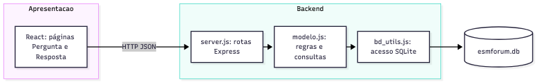

# Análise da arquitetura atual — Parte 3

O ESM Forum usa uma **SPA React separada de uma API HTTP Express**, com uma organização próxima de MVC. A interface está em outro repositório; ela não renderiza no servidor. O backend concentra controladores em `server.js`, regras e consultas em `modelo.js`, e acesso SQLite em `bd/bd_utils.js`. A extensão de busca introduz `ServicoBusca`, `CriterioTexto` e `RepositorioPerguntasSqlite`, mas o restante do código ainda conserva a estrutura original.

[Fonte Mermaid](diagramas/arquitetura_atual.mmd).

| Camada | Componentes reais | Responsabilidade |
|---|---|---|
| Apresentação | `esmforum-react/src/pages/` | Formulários, tabela e navegação |
| Transporte/controlador | `server.js` | Rotas, corpo/requisição, status e JSON |
| Negócio/modelo | `modelo.js`; `busca/servicoBusca.js` | Operações de perguntas/respostas e validação da busca |
| Dados | `bd/bd_utils.js`; `busca/repositorioSqlite.js`; SQLite | SQL e persistência |

O React usa `fetch` para `http://localhost:5000`. Requisições e respostas são JSON; o backend habilita CORS para a origem de desenvolvimento. O fluxo de leitura é `React → GET / → server.js → modelo.js → bd_utils.js → SQLite → JSON → React`. Com `q`, o fluxo passa por `ServicoBusca` e `RepositorioPerguntasSqlite`. Não há autenticação, fila de eventos nem serviço de perfis; esses componentes só aparecem como propostas para as funcionalidades futuras.

**Limites observados:** a rota raiz concentra listagem e busca; `modelo.js` contém SQL e lógica de várias operações; `listar_perguntas` consulta contagem para cada pergunta; `server.js` inicia a escuta ao ser importado. O sistema foi feito para ensino, então uma reorganização incremental é mais apropriada que reescrever tudo.
