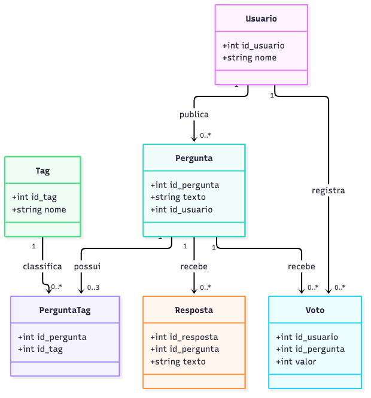
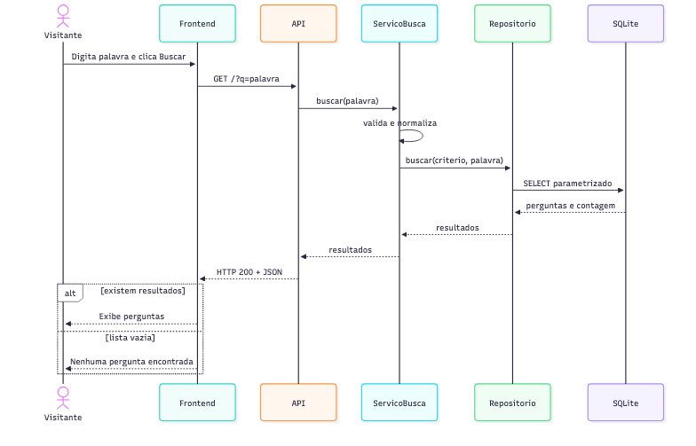
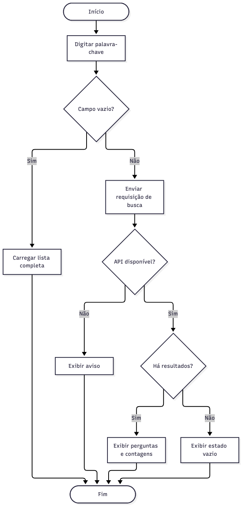
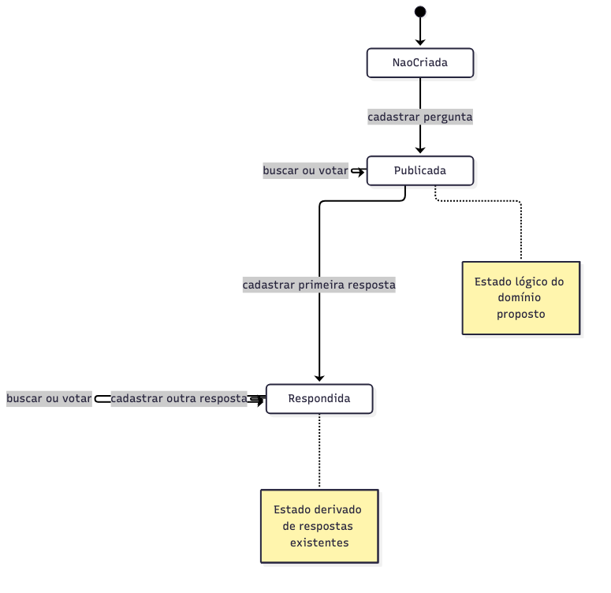

# Diagramas UML — Parte 2

Cada imagem tem sua fonte `.mmd` no diretório `diagramas/`. As imagens foram geradas pela Mermaid CLI 12.0.0 e são entregues como PNG.

## Classes

[Fonte Mermaid](diagramas/diagrama_classes.mmd). `Pergunta` e `Resposta` refletem o banco atual. `Usuario` é conceitual: o sistema recebido usa `id_usuario`, mas ainda não possui tabela de usuários nem autenticação. `Voto`, `Tag` e `PerguntaTag` são propostas para P2 e P3; não devem ser confundidos com tabelas já implementadas. A busca P1 consulta o texto de `Pergunta` e não acrescenta entidade persistida.

## Sequência: buscar perguntas

[Fonte Mermaid](diagramas/diagrama_sequencia.mmd). A sequência espelha o caso de uso: visitante, React, API, serviço, repositório e SQLite; inclui retorno com resultados ou lista vazia.

## Atividades: buscar perguntas

[Fonte Mermaid](diagramas/diagrama_atividades.mmd). As decisões são campo vazio, disponibilidade da API e existência de resultados. Não há fluxo paralelo necessário nessa operação síncrona.

## Estados: pergunta

[Fonte Mermaid](diagramas/diagrama_estados.mmd). “Publicada” e “Respondida” são estados lógicos derivados da existência de respostas; não há coluna de estado no banco. Buscar e votar não alteram o estado da pergunta, enquanto a primeira resposta a torna respondida.
