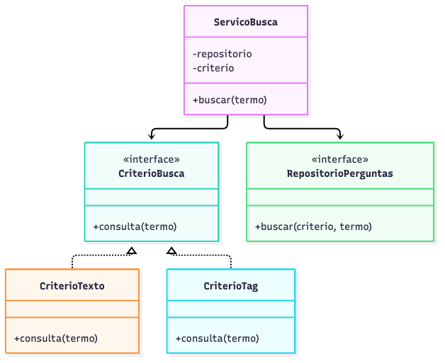
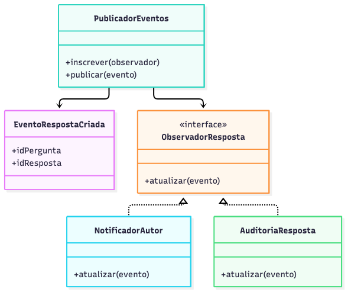
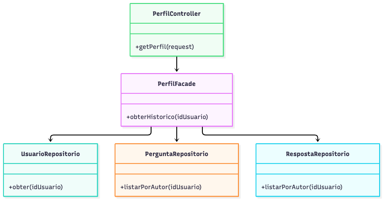

# Três padrões de projeto aplicados ao ESM Forum

Os diagramas são PNGs e cada imagem possui uma fonte Mermaid `.mmd` em `diagramas/`. Strategy já tem um núcleo funcional na busca; Observer e Facade são propostas para iterações futuras.

## 1. Strategy — critérios de busca e tags

**Contexto e problema.** A busca atual procura texto de pergunta. A funcionalidade P3 adicionará filtragem por tag. Inserir muitos `if` no serviço para decidir a consulta faria o serviço mudar sempre que um filtro novo surgisse.

**Solução.** `ServicoBusca` recebe um objeto `CriterioBusca` com `consulta(termo)`. `CriterioTexto` constrói uma condição literal parametrizada; `CriterioTag` poderá gerar uma condição baseada nas tabelas `tags` e `pergunta_tags` após a migração. O repositório executa a consulta e devolve resultados uniformes. O frontend escolhe o modo e a composição seleciona a estratégia apropriada. A estratégia atual é confiável e criada no servidor; entradas HTTP não fornecem fragmentos de SQL.



[Fonte Mermaid](diagramas/padrao_strategy.mmd).

```js
class CriterioTag {
  consulta(nome) {
    return { where: 'EXISTS (SELECT 1 FROM pergunta_tags pt JOIN tags t ON t.id_tag = pt.id_tag WHERE pt.id_pergunta = p.id_pergunta AND t.nome = ?)', params: [nome] };
  }
}
const buscaTags = new ServicoBusca(repositorioPerguntas, new CriterioTag());
```

## 2. Observer — notificação de novas respostas

**Contexto e problema.** P5 pede avisar o autor quando uma resposta é criada. Colocar envio de e-mail diretamente em `cadastrar_resposta` acoplaria a gravação ao canal de entrega e tornaria uma falha de e-mail capaz de impedir o fórum de responder.

**Solução.** Após persistir a resposta, `RespostaService` publica `EventoRespostaCriada`. `PublicadorEventos` chama observadores inscritos. `NotificadorAutor` consulta preferências e enfileira um aviso; `AuditoriaResposta` registra o evento. Em produção, a entrega deve ser assíncrona e idempotente, com tratamento de falhas. O pedido da resposta retorna após a persistência e publicação segura do evento, sem aguardar o envio externo.



[Fonte Mermaid](diagramas/padrao_observer.mmd).

```js
publicador.inscrever(notificadorAutor);
publicador.inscrever(auditoria);
const resposta = respostaRepo.criar(idPergunta, texto);
publicador.publicar({ tipo: 'RespostaCriada', idPergunta, idResposta: resposta.id });
```

## 3. Facade — perfil e histórico

**Contexto e problema.** P4 precisa combinar cadastro de usuário, perguntas e respostas. Se o controlador fizer várias consultas e composição manual, ficará acoplado aos detalhes de cada repositório.

**Solução.** `PerfilFacade.obterHistorico(idUsuario)` coordena `UsuarioRepositorio`, `PerguntaRepositorio` e `RespostaRepositorio` e retorna um DTO de perfil. `PerfilController` valida o identificador e serializa JSON. Uma versão futura pode paginar as listas e aplicar autorização dentro do serviço sem expor essa complexidade ao controlador.



[Fonte Mermaid](diagramas/padrao_facade.mmd).

```js
class PerfilFacade {
  constructor(usuarios, perguntas, respostas) { Object.assign(this, { usuarios, perguntas, respostas }); }
  obterHistorico(id) {
    return { usuario: this.usuarios.obter(id), perguntas: this.perguntas.listarPorAutor(id), respostas: this.respostas.listarPorAutor(id) };
  }
}
```

**Viabilidade.** Observer requer identidade e preferências; Facade requer modelo de usuário persistente. Nenhum dos dois está implementado nesta entrega. Strategy é usado apenas onde há variação efetiva de critério; não substitui a regra de negócio de tags ou a migração do banco.
