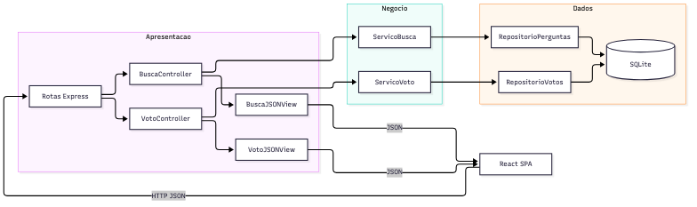

# Proposta de organização arquitetural — Parte 3

## Camadas e dependências

[Fonte Mermaid](diagramas/arquitetura_proposta.mmd).

| Camada | Módulos propostos | Responsabilidade | Comunicação |
|---|---|---|---|
| Apresentação/API | `routes/perguntas.js`, `routes/votos.js`, `controllers/BuscaController.js`, `controllers/VotoController.js`, `views/BuscaJSONView.js`, `views/VotoJSONView.js` | Ler parâmetros, status HTTP e representação JSON; não conter SQL | Chama serviços por contratos injetados |
| Negócio | `services/ServicoBusca.js`, `services/ServicoVoto.js`, `criteria/CriterioTexto.js`, `criteria/CriterioTag.js` | Validar busca, voto único, troca/remoção de voto e regra de classificação | Chama interfaces de repositório |
| Dados | `repositories/RepositorioPerguntasSqlite.js`, `repositories/RepositorioVotosSqlite.js`, `bd/bd_utils.js` | Consultas, transações e migração SQLite | Implementa contratos exigidos pelos serviços |

Um módulo de composição inicializa conexões, repositórios, serviços e controladores. A dependência segue de fora para dentro: regras de negócio não importam Express nem `better-sqlite3`. A implementação atual de busca já aplica a fronteira serviço/repositório; a separação formal de diretórios e os demais módulos são proposta, não código entregue.

## MVC no backend: busca e votação

### Busca (P1)

- **Model:** entidade `Pergunta` e `RepositorioPerguntas` devolvem `id_pergunta`, `texto`, `id_usuario`, `num_respostas`; `ServicoBusca` aplica validação e critério.
- **Controller:** `BuscaController.listar(req, res)` decide se `q` está presente, chama o serviço e traduz validação em HTTP 400.
- **View:** `BuscaJSONView` transforma os resultados em uma lista JSON estável, com campos conhecidos. O React continua sendo a visão visual.

Fluxo completo: `GET /?q=sqlite` → controller lê `q` → serviço valida e consulta repositório → SQLite devolve perguntas e contagem → view monta JSON → controller envia HTTP 200 → React preenche a tabela. Termo vazio enviado à API gera HTTP 400; lista vazia válida gera HTTP 200 com `[]`.

### Votação (P2)

- **Model:** `Voto(id_usuario, id_pergunta, valor)` com restrição única `(id_usuario, id_pergunta)` e `valor` em `-1, +1`; `RepositorioVotos` faz transação e computa placar com `SUM(valor)`.
- **Controller:** `VotoController.registrar(req, res)` lê identificação, pergunta e direção do voto, chama o serviço e devolve 200/201 ou erro 400/401/404 conforme validação. A identidade deve vir de autenticação real, nunca de um ID arbitrário enviado pelo navegador.
- **View:** `VotoJSONView` devolve `{ id_pergunta, placar, meu_voto }`, sem expor dados de outros eleitores. React atualiza os botões e o placar.

Fluxo completo: `PUT /perguntas/:id/voto` → controller obtém identidade autenticada → serviço valida pergunta e voto → repositório transaciona inserção, troca ou remoção → repositório calcula placar → view forma JSON → React atualiza a tela. A transação evita placar divergente sob requisições simultâneas.

## Migração incremental

1. Extrair o `app` de `server.js` para permitir teste HTTP e preservar as rotas existentes.
2. Mover gradualmente handlers para controladores sem mudar contratos externos.
3. Introduzir repositórios de domínio e migrações versionadas. Para votação, criar `votos`; para tags, criar `tags` e `pergunta_tags` com chaves estrangeiras e índices.
4. Adicionar autenticação antes de votação, perfil e notificações. O banco recebido só contém `id_usuario` numérico; ele não define usuário real.
5. Cobrir cada fatia com testes de serviço, repositório e API antes de remover funções antigas.

Essa evolução preserva a demonstração atual e permite entregar valor por funcionalidade, sem exigir uma reescrita ampla para implementar a busca.
